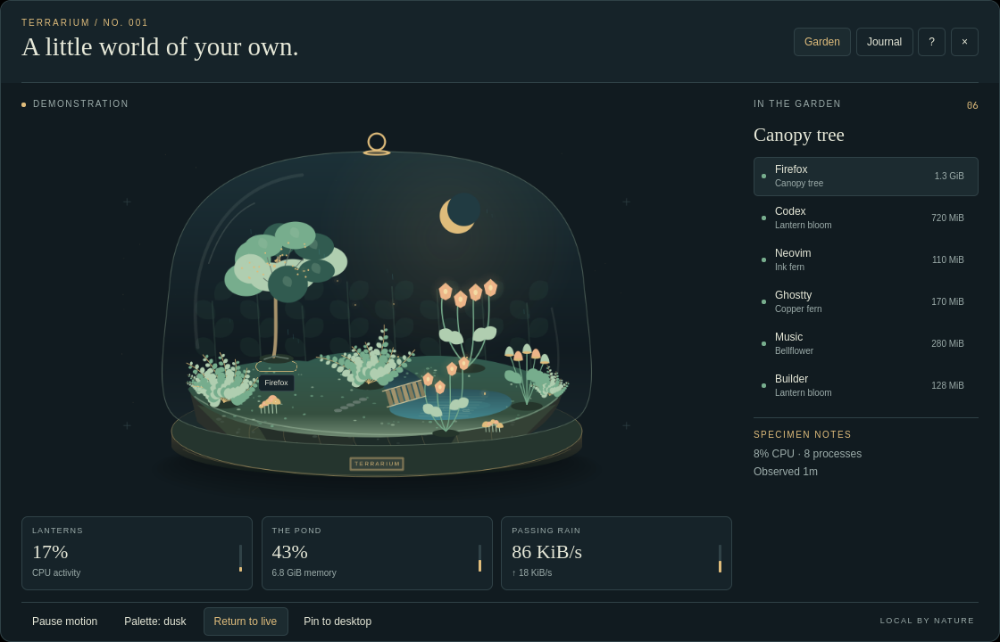
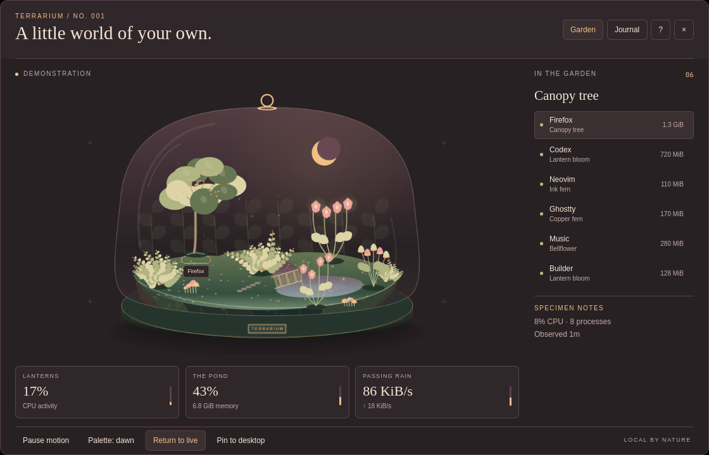
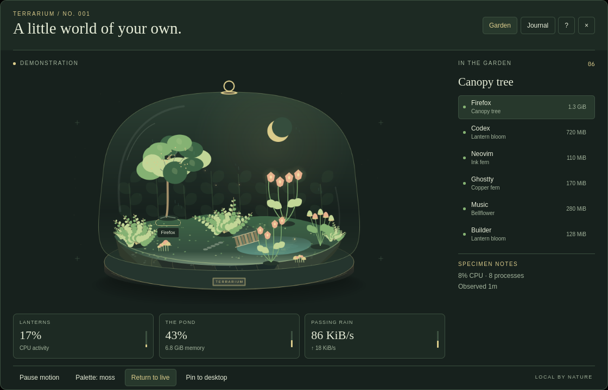
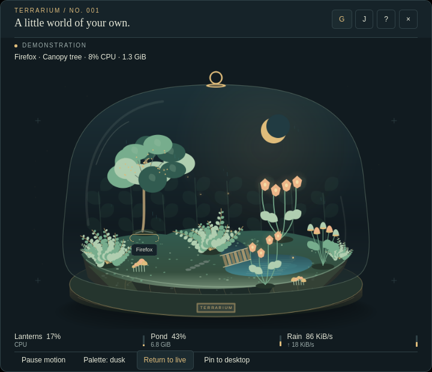

# Desktop Terrarium

A small living world for Omarchy, shaped by the activity of your computer.

Native QtQuick inside the Omarchy Quattro shell. Original procedural artwork, no account, no network connection, and no AI subscription required to run it.



[Watch the ten-second demo](https://github.com/LostandAdrift/desktop-terrarium/releases/download/v0.1.0/terrarium.webm) · [Release notes](CHANGELOG.md) · [Validation](docs/validation.md)

<details>
<summary>Dawn, Moss, and a compact window</summary>





</details>

## Install

Requires **Omarchy 4**, Quickshell, and Python 3.10 or newer. Tested on Omarchy 4.0.2 with Qt 6.11.2. Node.js is only needed for development checks.

```sh
omarchy plugin add https://github.com/LostandAdrift/desktop-terrarium.git --enable
```

Click the Terrarium icon in the bar, or open it from a terminal:

```sh
omarchy-shell shell summon io.github.lostandadrift.terrarium '{}'
```

## Explore

- **Garden:** up to seven groups of your applications become residents. Their positions stay stable as rankings change, and growth accumulates while you observe. CPU, memory, and network traffic shape the environment.
- **Journal:** a bounded, in-memory record of arrivals and departures. A departed process is never presented as a successful task.
- **Guide:** explains each signal and its limits inside the app.
- **Demo:** explicitly labeled synthetic activity, useful for exploring without real process data.
- **Pin:** keeps a click-through garden behind normal windows on the first display.
- **Motion:** pause animation while numeric readings continue to update.
- **Palette:** choose Dusk, Dawn, or Moss, or let Auto follow the local time.

| Key | Action |
| --- | --- |
| G / J / H | Garden / Journal / Guide |
| Left / Right | Select a resident |
| Up / Down, Page Up / Down, Home / End | Scroll the guide or journal |
| P | Pause or resume motion |
| C | Change palette |
| D | Toggle demo |
| A | Pin or unpin the desktop garden |
| Tab, Enter, Space | Focus and activate controls |
| Escape | Return to Garden, then close |

## Local and honest

The observer reads aggregate Linux `/proc` counters and same-user process names and numeric usage. It never reads command lines, environment variables, window titles, browser URLs, or application content. It never sends anything over the network, and it never changes another process or a system setting.

Garden state and the journal live in memory and reset when the shell restarts or the plugin reloads. Only display preferences are saved by Omarchy. Closing the panel stops observation and animation unless the garden is pinned.

All monitors share one observer and the same live garden. Demo is separate from live state; a pinned live garden continues observing while a demo panel is open.

CPU percentages use whole-machine capacity. Group memory sums resident pages and can count shared pages more than once. Network totals may count traffic at several layers when using VPNs or virtual interfaces. Missing readings stay unknown. See [the telemetry specification](docs/telemetry.md) for formulas, bounds, and failure behavior.

## Settings and maintenance

The in-app controls persist preferences through Omarchy. The bar entry also accepts these values:

```json
{
  "id": "io.github.lostandadrift.terrarium",
  "reducedMotion": false,
  "palette": "auto",
  "ambient": false
}
```

Update, disable, or remove using the standard plugin commands:

```sh
omarchy plugin update io.github.lostandadrift.terrarium
omarchy plugin disable io.github.lostandadrift.terrarium
omarchy plugin remove io.github.lostandadrift.terrarium
```

If an observation fails, the panel shows its status and offers Retry. If you are editing QML locally and an old component stays cached, restart the Omarchy shell after saving your work.

## Development

See [CONTRIBUTING.md](CONTRIBUTING.md) for offline checks and opt-in native lifecycle tests. The [architecture](docs/architecture.md) explains process ownership and rendering; the [validation record](docs/validation.md) includes tested configurations, resource measurements, and limits. Production code uses Python's standard library and QtQuick/Quickshell already present in Omarchy.

## License

MIT. Copyright © 2026 LostandAdrift. Artwork is generated by the source in this repository; there are no downloaded image assets or external fonts.
