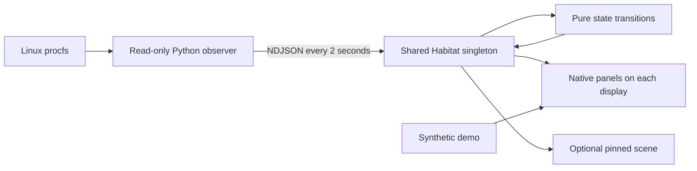

# Architecture

Terrarium lives inside the existing Omarchy shell. There is no separate application server, web view, daemon, account, or runtime network dependency.

`scripts/collect.py` samples procfs with Python's standard library. It bounds file reads, process enumeration, interface counts, output groups, and diagnostic messages. Tests supply synthetic procfs trees, including disappearing processes and reused PIDs. The [telemetry specification](telemetry.md) defines the counters and their limitations.

`runtime/Habitat.qml` owns one observer process per shell engine and one live garden. Each panel registers a unique watcher while it needs live observations; the pinned scene registers through its host panel. The last watcher leaving initiates shutdown. Reopening waits for an intentional shutdown to finish before starting another observer. Unexpected exit, including exit code zero, becomes a recoverable error. A watchdog marks readings stale after nine seconds without a valid sample.

An intentional shutdown keeps ownership until the child actually exits, including when it is stalled. Retry cannot overlap a replacement observer with that child. The collector unwinds promptly on SIGTERM even during a slow scan, and an overrunning scan rests before sampling again.

`Model.js` normalizes incoming data and implements deterministic state changes. Resident positions survive ranking changes. Eighteen seconds of absence avoids unnecessary churn; the garden retains at most seven residents and twenty-four journal entries. Long observation gaps are capped when accumulating growth. Neither garden state nor process history is written to disk.

`TerrariumView.qml` is ordinary QtQuick and can run offscreen independently of Omarchy. It receives state through properties and emits actions through signals. `Terrarium.qml` connects those actions to Omarchy's panel, bar, settings, and layer-shell APIs. The `runtime` module keeps Quickshell-specific imports out of the portable view tests.

`ScenePainter.js` draws the original illustration into a canvas when composition, growth buckets, memory buckets, or palette change. `GardenScene.qml` animates small scene-graph objects at twenty updates per second; it does not redraw the illustration every animation tick. Motion stops when the scene is hidden or reduced motion is enabled. Numeric observations can continue while motion is paused.

Demo uses its own garden and clearly labeled synthetic counters. Changing demo mode cannot overwrite the live garden. A pinned live scene may continue observing while a panel displays the demo.

## IPC

The shell's standard summon/hide interface owns panel visibility. A single Terrarium IPC handler serves all monitors and forwards panel actions to the open instance. It exposes state, section selection, demo, motion, palette, pinning, and observer retry. It provides no arbitrary execution, file access, or process-management interface.

The repository's native smoke test uses that same interface, including fault injection into the observer PID explicitly returned by Terrarium. Fault injection belongs to the opt-in development script, not to the plugin.
