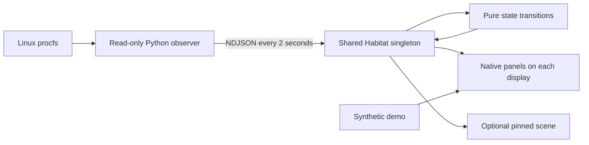

# Architecture

Terrarium lives inside the existing Omarchy shell. There is no separate application server, web view, daemon, account, or runtime network dependency.

`scripts/collect.py` samples procfs with Python's standard library. It bounds file reads, process enumeration, interface counts, output groups, and diagnostic messages. Tests supply synthetic procfs trees, including disappearing processes and reused PIDs. The [telemetry specification](telemetry.md) defines the counters and their limitations.

`runtime/Habitat.qml` owns one observer process per shell engine and one live garden. Each panel's `ObserverLease` registers a unique watcher while it needs live observations; the pinned scene registers through its coordinator panel. Locking the session or losing all displays releases observation. The last watcher leaving initiates shutdown. Reopening waits for an intentional shutdown to finish before starting another observer. Unexpected exit, including exit code zero, becomes a recoverable error. A watchdog uses a monotonic elapsed timer to mark readings stale after nine seconds without a valid sample, independently of calendar changes.

An intentional shutdown keeps ownership until the child actually exits, including when it is stalled. Retry cannot overlap a replacement observer with that child. The collector unwinds promptly on SIGTERM even during a slow scan, and an overrunning scan rests before sampling again.

`Model.js` normalizes incoming data and implements deterministic state changes. Resident positions survive ranking changes. Eighteen seconds of absence avoids unnecessary churn; the garden retains at most seven residents and twenty-four journal entries. Long observation gaps are capped when accumulating growth. Neither garden state nor process history is written to disk.

Growth combines a quick initial unfurl with a slower curve over hours of actual observation. Calendar jumps, failed scans and the time a resident spends absent do not advance its age. No streak, score, or saved history is needed for a longer-lived garden.

A failed or incomplete application scan holds residents, growth and absence grace in place, marks their readings unavailable, and creates no false departure notes. Complete empty scans still count as genuine absence. Aggregate weather can continue updating when those separate counters remain available.

`TerrariumView.qml` is ordinary QtQuick and can run offscreen independently of Omarchy. It receives state through properties and emits actions through signals. `Terrarium.qml` connects those actions to Omarchy's panel, bar, settings, and layer-shell APIs. The `runtime` module keeps Quickshell-specific imports out of the portable view tests.

`ScenePainter.js` draws original procedural illustration into separate ground, bridge, glass and resident canvases. Seven permanent `PlantSprite` slots retain cached botanical textures across telemetry updates; growth, sway, flower opening and glow use scene-graph transforms. `SceneDynamics.js` holds pure interpolation, day/night and interaction math. One twenty-hertz clock advances the scene; effects are capped at four and expire. Motion stops when hidden or reduced motion is enabled, with a static acknowledgment for touches. Numeric observations can continue while motion is paused. Local time changes the sky independently of telemetry and still advances during demo-only viewing.

Demo uses its own garden and clearly labeled synthetic counters. Changing demo mode cannot overwrite the live garden. A pinned live scene may continue observing while a panel displays the demo.

`Placement.js` resolves the pinned destination by saved display name, falling back to the first available output while retaining a disconnected preference. The first panel remains the single coordinator regardless of that destination. Logical dimensions, bounded insets and one horizontal/vertical anchor preserve the vessel's proportions. The layer respects the bar's reserved space and reserves none itself. Art mode reuses the panel's existing scene; Options pauses that scene while settings are being changed.

## IPC

The shell's standard summon/hide interface owns panel visibility. A single Terrarium IPC handler serves all monitors and forwards panel actions to the open instance. It exposes state, section selection, demo, motion, palette, pinning, and observer retry. It provides no arbitrary execution, file access, or process-management interface.

The repository's native smoke test uses that same interface, including fault injection into the observer PID explicitly returned by Terrarium. Fault injection belongs to the opt-in development script, not to the plugin.
